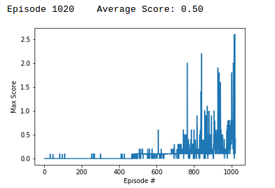

# Project Collaborate and Compete

### Algorithm used

Deep Deterministic Policy Grdients algorithm has been used to complete the project as the action space is continuous.
There are some minor modifications such as network is updated 10 times after every 5 time steps. This helped produce better performance.

### Hyperparameters
I had problem finding the correct hyperparameters to train the network. The score would increase but never crossed an avaerage score of 0.5 and rather went to 0.3 at maximum. After lot of experimentation, the following hyperparamaters were found to give the best results.
* BUFFER_SIZE = int(1e6)  # replay buffer size
* BATCH_SIZE = 1024       # minibatch size
* GAMMA = 0.99            # discount factor
* TAU = 1e-3              # for soft update of target parameters
* LR_ACTOR = 9e-4         # learning rate of the actor 
* LR_CRITIC = 1e-3        # learning rate of the critic
* WEIGHT_DECAY = 0.0000   # L2 weight decay

### Network Architectures

#### Actor Network
* Batch normalization on input.
* A hidden layer with 256 units, relu activation.
* Second hidden layer with 128 units, relu activation.
* Fully connected layer with tanh activation.

#### Critic Network
* Batch normalization on input.
* A hidden layer with 256 units, relu activation.
* Second hidden layer with 128 units, relu activation.
* Fully connected layer with tanh activation.

## Plot of rewards

The task was completed in 1020 episodes by achieveing an average score of 0.5+

## Future work for improving the performance
Project will be solved using other algorithms such as PPO, MADDPG.